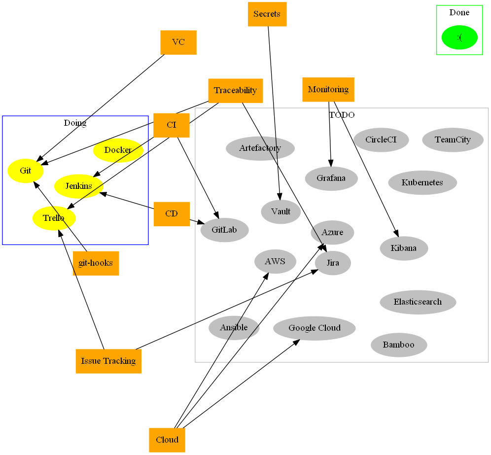

# Laroy Radar
For visualizing what I'm doing, not doing, and (at some point) intend on doing.

### What is going on?
Every topic should have intent - there should be a reason it's there.
A tool, e.g., should be tied to (at least) one such reason, as well as convey its current status (todo, doing, done).

#### Statuses of topics/nodes

- `TODO`
    - I've simply not started looking into it
- `Doing`
    - I am currently doing something here
        - Maybe I should provide links to those things in some way
- `Done`
    - It's not clear how I want to define this, and its existence is currently pending
        - Alternatives might be: "Have done", "Looked into", "Reached an obstacle", etc.

---

## Current and Past Explorations

### [PipelinePlayground](https://github.com/lolpatrol/PipelinePlayground)
- Reasons: `CI`, `CD`, `Pipeline`

- Using: `Jenkins`, `Git`, `Docker`

Setting up Jenkins in Docker, using Docker in Jenkins to build things, and trigger builds from git-hooks.

### [git2trello](google.com)
- Reasons: `Traceability`, `git-hooks`

- Using: `Git`,`Trello`, `Python`

Forcing traceability between a commit and a task/issue into workflow by prompting a user to choose an issue from 
a Trello board, adding GitHub-URL of the commit to the task/issue as a comment, and adding the task/issue-URL 
to the commit message.

